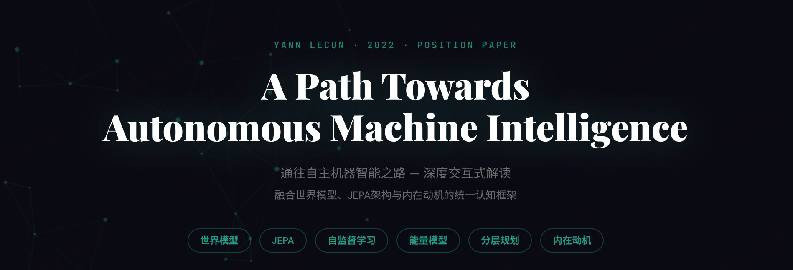

# AMI Explorer — LeCun 论文交互式解读

## A Path Towards Autonomous Machine Intelligence

对 Yann LeCun 2022 年立场论文的深度交互式可视化解读，涵盖世界模型、JEPA 架构、能量模型与分层规划的完整技术框架。

### ✨ 交互功能

- **六模块认知架构图** — 点击模块查看详细描述与连接关系
- **JEPA vs 生成式 vs 对比学习** — 三种范式的可视化对比切换
- **分层 JEPA（H-JEPA）** — 悬停查看不同时间尺度的预测层级
- **能量地形图** — 可拖动球体直观感受「推理 = 能量最小化」
- **训练范式蛋糕类比** / **JEPA 落地时间线** / **三大路线之争**

### 🚀 在线访问
[🔗交互式链接](https://siryzhang.github.io/A-Path-Towards-Autonomous-Machine-Intelligence/)

### 🔗 原论文

- **PDF**: [Introduction to Latent Variable Energy-Based Models: A Path Towards Autonomous Machine Intelligence](https://arxiv.org/abs/2306.02572))

### 技术栈

- React 18 (CDN)
- Babel Standalone (浏览器端 JSX 编译)
- Canvas API (神经网络背景动画)
- SVG (架构图 / 能量地形)
- Google Fonts (Playfair Display + DM Sans + Noto Sans SC)

### 📄 License

MIT
